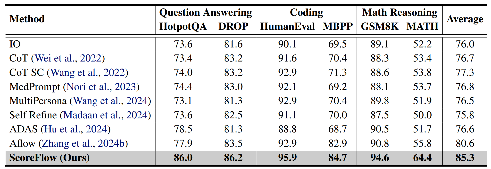

# ScoreFlow

## Introduction
ScoreFlow is an automated multi-agent workflow generation and optimization method, which leverages efficient gradient-based optimization in a continuous space. ScoreFlow incorporates Score-DPO, a novel variant of the direct preference optimization method that accounts for quantitative feedback. Across six benchmarks spanning question answering, coding, and mathematical reasoning, ScoreFlow achieves an 8.2\% improvement over existing baselines. Moreover, it empowers smaller models to outperform larger ones with lower inference costs.


<p align="center">
  
</p>

## Setup

1. You need approximately **80-90GB** VRAM. You can modify your GPU settings in `./config/config1.yaml`.
2. Set up your api key in `./config/config2.yaml`.
3. Download [dataset](https://github.com/yinjjiew/Data/raw/main/scoreflow_data/data.zip) and unzip it in this directory `./`.
4. To set up the environment, follow these steps:

```bash
conda create -n scoreflow python=3.10
source activate scoreflow
pip install --upgrade git+https://github.com/geekan/MetaGPT.git
pip install -r requirements.txt

```
You can ignore the dependency error of metagpt 0.8.1.

## Optimization Process

To optimize the model, follow these steps iteratively from `i = 0` then `i = 1`, and so on:

```bash
python generate.py --dataset=HumanEval --task=optimize --epoch=i
python evaluate.py --dataset=HumanEval --task=optimize --epoch=i
accelerate launch --num_processes=1 optimize.py --epoch=i

```

You can change the number of iterations by incrementing `i`. The dataset you can choose: HumanEval, MBPP, MATH, GSM8K, DROP, and HotpotQA.

## Inference

To run inference on the test set, execute:

```bash
python generate.py --dataset=HumanEval --task=inference --epoch=2
python evaluate.py --dataset=HumanEval --task=inference --epoch=2

```

## Notes

- Adjust the number of epochs as needed.
- Ensure all dependencies are installed from `requirements.txt`.
- The optimization and inference scripts should be run sequentially.
- If `evaluate.py` gets stuck, try rerunning it.


